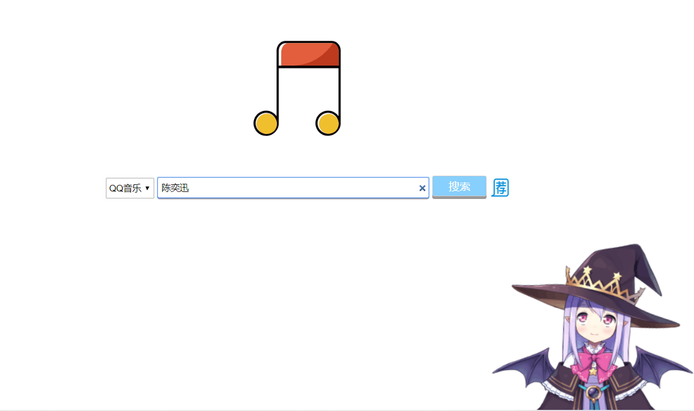

# QQMusicDownloader
网络编程技术课设，试听下载音乐网站

## 功能
- 搜索试听下载歌曲，曲库源于QQ音乐
- 界面展示
    - 首页
    
    - 结果页
    

## 特色
- ~~可试听下载版权歌曲~~
- 可通过推荐获得 QQ音乐巅峰分享榜 推荐的歌曲
- 炫酷的浮窗播放器（基于明空皓月）
- 采用非转基因原料，纯正无添加剂 ***废话，你会往课设里添广告***
- 网页右下角有可爱live2d小人 ***程序员可喜欢可爱的妹子了***，每次访问会随机选择人物和服饰

### TODO
- 以弹框的形式实现一个更好看的试听音乐界面 初步实现
    - 基本完成，待微调美化
- QQ的api好像不能直接下最高音质了，等我鸽完再更新
- 解决chrome对外链的下载问题，或者说直接下载且无需重新命名的问题
